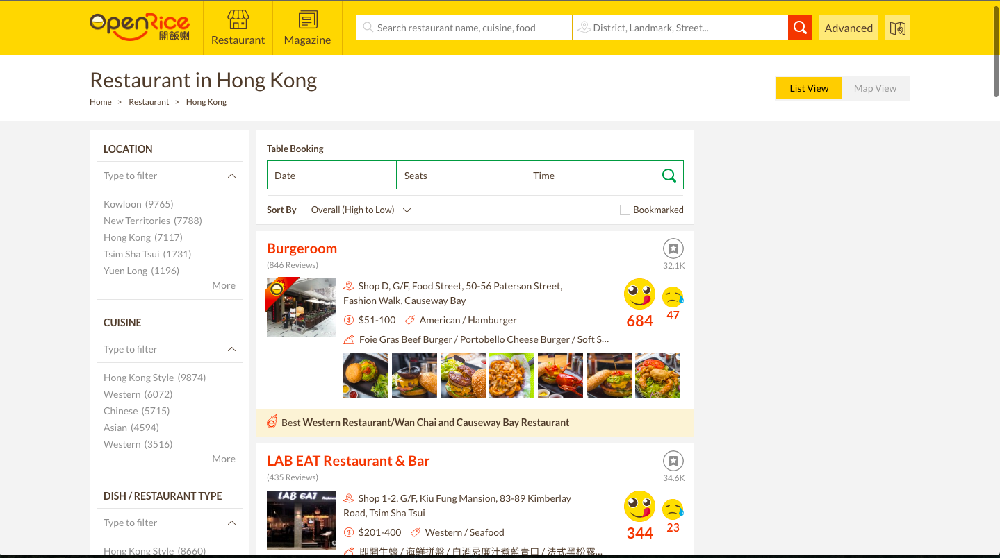

@title[Cover Page]

# Recom<span class="gold">mend</span>

#### Creating a recommendator for Openrice users
<br>
<br>

<span class="byline">Lyoe Lee - Dec 2017</span>

---

@title[Outline]

#### Openrice <span class="gold">Recommendation</span> 
##### Goal: Try to recommend a restaurant to users

<br>

@fa[arrow-down](Press down for more...)
<!-- <span class="aside">Press down for more...</span> -->

+++

#### What to <span class="gray">Eat?</span>

<br>

#### Familiar with <span class="gold">Openrice?</span>
<!-- #### Familiar with <span class="gold">Netfilx?</span> -->

<br>

@fa[arrow-down]

+++

#### <span class="gold">Who?</span>

Anybody who loves to <span class="gold">eat</span> (and <span class="gold">rate</span>)

---

@title[Summary - Part 1]

#### Goals?

<br>
- Predict the right restaurants to users |

<br>

<!-- <span class="aside">Not that easy....</span> -->

@fa[arrow-down]

+++

#### Steps?

<br>

- Scrape top rated restuarants from Openrice |

@fa[arrow-down]

+++?image=assets/pic/openrice_restaurant_search_first.png

+++?image=assets/pic/openrice_restaurant_search.png

<!--  -->

+++

#### Steps?

<br>

- <span class="darkgray"> Scrape top rated restuarants from Openrice</span>
- Get each reviews and ratings |

@fa[arrow-down]

+++?image=assets/pic/openrice_user_review_first.png

+++?image=assets/pic/openrice_user_review.png

---
@title[Summary - Part 2 (Data)]

#### Data!
<br>

- Scrape all these data down |
- Before showing the data... |

---

@title[Summary - Part 3 (Challenges)]

#### Challenge 1...!?
<br>
- Learn [Scrapy](https://scrapy.org/)! |

@fa[arrow-down]

+++

### Scrapy 101:<span class="gold"> Some Codes</span>

```python
class JsonWriterPipeline(object):

    def open_spider(self, spider):
        self.file = open('reviewresult.jl', 'w')

    def close_spider(self, spider):
        self.file.close()

    def process_item(self, item, spider):
        line = json.dumps(dict(item)) + "\n"
        self.file.write(line)
        return item

class ExtractSpider(scrapy.Spider):
    name = "Extract"
    start_urls = review_urls

    custom_settings = {
        'LOG_LEVEL': logging.WARNING,
        'ITEM_PIPELINES': {'__main__.JsonWriterPipeline': 1}, # Used for pipeline 1
        'FEED_FORMAT':'json',                                 # Used for pipeline 2
        'FEED_URI': 'reviewresult.json'                        # Used for pipeline 2
    }
    
    def parse(self, response):
        for user in response.xpath('//*[@class="sr2-review-list-container full clearfix js-sr2-review-list-container"]'):
            yield {
                # https://stackoverflow.com/questions/20081024/scrapy-get-request-url-in-parse
                'link': response.url,
                'user': user.xpath('div[1]/section/div[1]/a/text()').extract(),
                'user_url' : user.xpath('div[1]/section/div[1]/a/@href').extract(),
                'rating': user.xpath('div[2]/section/div[1]/div[1]/div').extract(),
                'taste_star_1': user.xpath('div[3]/section/div[2]/div[2]/span[1]').extract(),
                'taste_star_2': user.xpath('div[3]/section/div[2]/div[2]/span[2]').extract(),
                'taste_star_3': user.xpath('div[3]/section/div[2]/div[2]/span[3]').extract(),
                'taste_star_4': user.xpath('div[3]/section/div[2]/div[2]/span[4]').extract(),
                'taste_star_5': user.xpath('div[3]/section/div[2]/div[2]/span[5]').extract(),
                'decor_star_1': user.xpath('div[3]/section/div[3]/div[2]/span[1]').extract(),               
                'decor_star_2': user.xpath('div[3]/section/div[3]/div[2]/span[2]').extract(),              
                'decor_star_3': user.xpath('div[3]/section/div[3]/div[2]/span[3]').extract(),               
                'decor_star_4': user.xpath('div[3]/section/div[3]/div[2]/span[4]').extract(),                
                'decor_star_5': user.xpath('div[3]/section/div[3]/div[2]/span[5]').extract(),                
                'service_star_1': user.xpath('div[3]/section/div[4]/div[2]/span[1]').extract(),                                
                'service_star_2': user.xpath('div[3]/section/div[4]/div[2]/span[2]').extract(),                                
                'service_star_3': user.xpath('div[3]/section/div[4]/div[2]/span[3]').extract(),                                
                'service_star_4': user.xpath('div[3]/section/div[4]/div[2]/span[4]').extract(),                                
                'service_star_5': user.xpath('div[3]/section/div[4]/div[2]/span[5]').extract(),                                                
                'hygiene_star_1': user.xpath('div[3]/section/div[5]/div[2]/span[1]').extract(),                                                
                'hygiene_star_2': user.xpath('div[3]/section/div[5]/div[2]/span[2]').extract(),                                                
                'hygiene_star_3': user.xpath('div[3]/section/div[5]/div[2]/span[3]').extract(),                                                
                'hygiene_star_4': user.xpath('div[3]/section/div[5]/div[2]/span[4]').extract(),                                                
                'hygiene_star_5': user.xpath('div[3]/section/div[5]/div[2]/span[5]').extract(),                                                
                'value_star_1': user.xpath('div[3]/section/div[6]/div[2]/span[1]').extract(),                                                                
                'value_star_2': user.xpath('div[3]/section/div[6]/div[2]/span[2]').extract(),                                                                
                'value_star_3': user.xpath('div[3]/section/div[6]/div[2]/span[3]').extract(),                                                                
                'value_star_4': user.xpath('div[3]/section/div[6]/div[2]/span[4]').extract(),                                                                
                'value_star_5': user.xpath('div[3]/section/div[6]/div[2]/span[5]').extract(),
            }
            
process = CrawlerProcess({
    'USER_AGENT': 'Mozilla/5.0 (Windows NT 6.0; WOW64; rv:24.0) Gecko/20100101 Firefox/24.0'
})

process.crawl(ExtractSpider)
process.start()

```
@[1-13](Define a class, saving in JSON)
@[14-24](Define a Extracting Spider, defining the URLs to scrape)
@[25-59](Defining the xpath/css to scrape and store in JSON)
@[60-65](Actual scraping of websites)

+++ 

#### Challenge 1...!?
<br>

- Learn [Scrapy](https://scrapy.org/)!
- Openrice limits...|
	- Only up to 17 pages per Region! | 
	- So I did only 3 regions (Hong Kong, Kowloon, New Territories) |
- <span class="darkgray"> Bad html consistency... </span>

@fa[arrow-down]

+++?image=assets/pic/openrice_17_page_limit.png

+++

#### Challenge 1...!?
<br>

##### In the end...

<br>

- 600+ Top reviewed restaurants |
- 160,000+ individual user reviews |
- 8000+ separate URLs |

@fa[arrow-down]

+++

#### Challenge 1...!?
<br>

- Learn [Scrapy](https://scrapy.org/)!
- Openrice limits...
	- Only up to 17 pages per Region!
	- So I did only 3 regions (Hong Kong, Kowloon, New Territories)
- Bad html consistency... |

@fa[arrow-down]

+++?image=assets/pic/openrice_html_inconsistency.png

+++?image=assets/pic/openrice_html_stars.png

---

@title[Summary - Data Tables]


<!-- <table>
  <tr>
    <th class="fragment">Name</th>
    <th class="fragment">Review URL</th>
    <th class="fragment">District</th>
    <th class="fragment">District ID</th>
    <th class="fragment">Category</th>
    <th class="fragment">Category ID</th>
    <th class="fragment">Price UI</th>
    <th class="fragment">Address</th>
    <th class="fragment">Review Count</th>
    <th class="fragment">Smile</th>
    <th class="fragment">Cry</th>
    <th class="fragment">Bookmark Count</th>
    <th class="fragment">Overall Score</th>
    <th class="fragment">Latitude</th>
    <th class="fragment">Longitude</th>
  </tr>
</table> -->

#### <span class="gold">DATA</span> 

+++?image=assets/pic/restaurant_table.png

+++?image=assets/pic/openrice_restaurant_search.png

+++?image=assets/pic/user_table.png

+++?image=assets/pic/openrice_user_review.png

---

@title[Model Insights: Visualization]

### <span class="gold">Exploratory Data Analysis (EDA)</span>

<br>

#### Restaurant overall
- District |
- Prices |
- Review Count |
- Overall Score |

<br>
@fa[arrow-down]

+++?image=assets/pic/restaurant_district.png

+++?image=assets/pic/restarant_price.png

+++?image=assets/pic/restaurant_review_count.png

+++?image=assets/pic/restaurant_review_table.png

+++?image=assets/pic/restaurant_overall_score.png

+++?image=assets/pic/restaurant_score_table.png

---

### <span class="gold">Exploratory Data Analysis (EDA)</span>
<br>
#### User reviews

<br>
@fa[arrow-down]

+++?image=assets/pic/user_district.png
+++?image=assets/pic/restaurant_district.png

---
@title[Modelling Approach]

### Challenge <span class="gold">2.. ?!</span>
<br>
<br>
#### Recommender system <span class="gold">Models</span>

+++

### <span class="gold">Content </span>Based

- If you are browsing at a <span class="gold"> gold T-shirt </span>, recommend other T-shirts or <span class="gold"> gold sweater </span> |
<br>

+++

### <span class="gold">Collaborative </span>Filtering

- User based |
	- Users similar to me also looked at these items |

<br>

- Item based |
	- Users who looked at my item also looked at these other items |

+++

### <span class="gold">Hybrid</span> 

+++

### <span class="gold">Collaborative</span> Filtering...?!?

+++

### <span class="gold">Memory based</span> Algo

- Calculate how "similar" a pair of users/items are |
- Using metrics such as "cosine" etc. from sklearn |
@fa[frown-o]
- Doesn't scale to real-world scenarios |
- Bad at dealing with Sparse matrix |
<br>

+++

### <span class="gold">Model based</span> Algo

- Matrix factorization |
- Unsupervised learning method |
- Deal better with scalability and sparsity |

<br>

+++

### <span class="gold">Sparcity</span>??

<br>

+++?image=assets/pic/sparse_matrix.png
+++?image=assets/pic/sparse_matrix_demeaned.png

+++

### <span class="gold">Model</span>-based Collaborative Filtering


k = latent factor 

latent factor:
a variable that we cannot directly observe but it’s possible to estimate

+++

### <span class="gold">New package</span>

- [Surprise Library](http://surpriselib.com/) |
	- <span class="gold">S</span>imple <span class="gold">P</span>ython <span class="gold">R</span>ecommendat<span class="gold">I</span>on <span class="gold">S</span>ystem <span class="gold">E</span>ngine |

---
@title[Model Results]

---
@title[Conclusion]

---
@title[Future/Next Steps]

---

@title[Step 3. Done!]

### <span class="gold">STEP 3. GET THE WORD OUT!</span>
<br>

<br>
<br>
#### Instantly use your GitPitch slideshow URL to promote, pitch or present absolutely anything.

---

@title[Slide Rich]

### <span class="gold">Slide Rich</span>

#### Code Presenting for Blocks, Files, and GISTs
#### Image, Video, Chart, and Math Slides
#### Multiple Themes with Easy Customization
<br>
#### <span class="gold">Plus collaboration is built-in...</span>
#### Your Slideshow is Part of Your Project
#### Under Git Version Control within Your Git Repo


---

### Go for it.
### Just add <span class="gold">PITCHME.md</span> ;)
<br>
[Click here to learn more @fa[external-link fa-pad-left]](https://github.com/gitpitch/gitpitch/wiki)